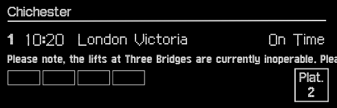
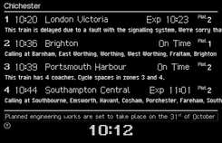
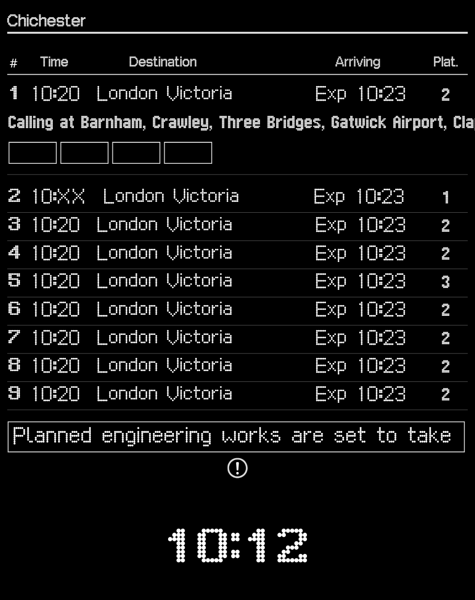
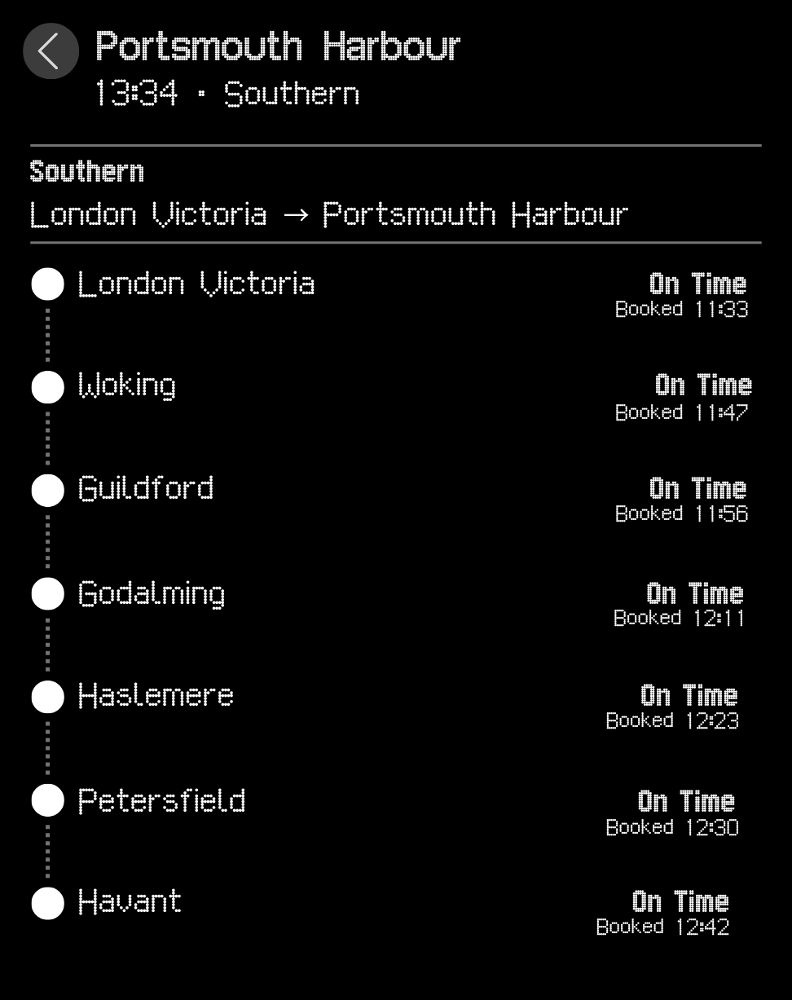

# Platform

[](https://github.com/OI1ver/Platform/actions/workflows/ci.yml)
[](https://github.com/OI1ver/Platform/releases/latest)
[](docs/INSTALLATION.md)
[](LICENSE)

Platform is a free, open-source macOS menu-bar departure board for Great
Britain. It puts live departures, platforms, delays, cancellations and calling
points one click away without keeping a full app window open.

> **Platform is currently an unsigned technical beta.** It is distributed only
> through GitHub—not the Mac App Store—and requires macOS 14 or later.

## Download

Download **[Platform 0.2.4](https://github.com/OI1ver/Platform/releases/latest)**,
unzip it and move `Platform.app` to Applications. Because the beta is not
notarised, first launch requires macOS's control-click **Open** flow. Follow the
[short installation guide](docs/INSTALLATION.md); never disable Gatekeeper
globally.

## The board

| Display | Extended | List |
| --- | --- | --- |
|  |  |  |
| The next departure at a glance. | Four departures plus station notices. | Up to nine departures in a compact table. |

Selecting a service opens its operator, route and ordered calling points in the
same menu-bar panel.



## Features

- Native SwiftUI menu-bar app with no Dock icon
- Search across 2,700+ Darwin-supported stations
- Multiple favourites with a configurable default station
- Display, Extended and List board modes
- Live platforms, expected times, cancellation and disruption information
- Calling points and service details
- Explicit loading, no-service, stale, offline and upstream-error states
- Local last-known-board cache and refresh only while the board is visible
- Keyboard navigation, VoiceOver labels and reduced-motion behaviour
- Local preferences, Keychain installation ID and optional launch at login
- No accounts, analytics, advertising or ticket sales

Read the [privacy summary](docs/PRIVACY.md) for the small amount of information
stored or sent by the app.

## How it works

The repository is a monorepo containing:

```text
Sources/PlatformApp/   Native macOS client
Tests/                 Swift unit tests
worker/                Cloudflare Worker relay and tests
docs/                  User, API and contributor documentation
scripts/               Station, packaging and release verification tools
```

The client calls a narrowly scoped Cloudflare Worker. The Worker holds Rail
Data Marketplace credentials, validates requests and normalises National
Rail's Darwin Live Departure Boards data. Credentials are never shipped in the
app or committed to this repository.

## Build and contribute

Requirements are macOS 14+, Xcode 16 or newer, Swift 6, Node.js and npm.

Start with the [development guide](docs/DEVELOPMENT.md), then read
[CONTRIBUTING.md](CONTRIBUTING.md) before opening a pull request. The relay
contract is documented in [docs/api.md](docs/api.md).

Security issues must be reported privately as described in
[SECURITY.md](SECURITY.md), not through a public issue.

## Releases and history

The exact source tree is retained from 0.2.4 onward. Installers for 0.1.0–0.2.3
survive as clearly labelled historical binary releases; their original source
snapshots were not retained. See the [changelog](CHANGELOG.md) and
[historical-release manifest](docs/HISTORICAL_RELEASES.md).

Updates are delivered through Sparkle and signed with a separately protected
EdDSA key. This protects update integrity independently of Apple Developer ID
signing.

## Data, attribution and licence

Live rail data is provided by National Rail through Darwin and remains subject
to the terms accepted through Rail Data Marketplace. Platform retains the
required National Rail attribution in the app.

Platform source code is available under the [MIT License](LICENSE). The bundled
London Underground dot-matrix typeface is separately licensed under the SIL
Open Font License 1.1; see [THIRD_PARTY_NOTICES.md](THIRD_PARTY_NOTICES.md).
